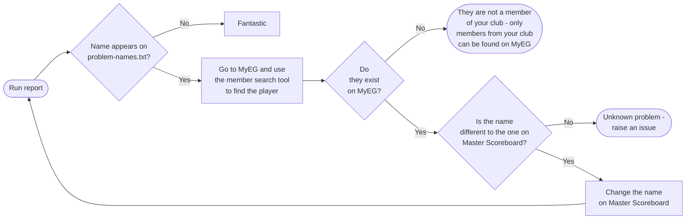

# Handicap Comparator

This tool allows you compare the handicaps held for players in Master Scoreboard and England Golf

### Installation:
**Windows**
- Clone this repo
- Get the [latest Python 3](https://apps.microsoft.com/store/detail/python-310/9PJPW5LDXLZ5)
- Create a copy of both _**config.py.example**_ and _**names_mapping.py.example**_, removing the _**.example**_ file extensions
  - This should leave you with _**config.py**_ and _**names_mapping.py**_
  - In config.py, change each of the values to your own according to the instructions in the file
- Double click ***setup.bat***

**Mac**
- Clone this repo
- Install python3 if you don't have the command line developer tools installed
- Create a copy of both _**config.py.example**_ and _**names_mapping.py.example**_, removing the _**.example**_ file extensions
  - This should leave you with _**config.py**_ and _**names_mapping.py**_
  - In config.py, change each of the values to your own according to the instructions in the file
- `cd` to the project in terminal and `pip install -r ./requirements.txt`

### Usage:
- **Windows** - double click ***run_report.bat***
- **Mac** - `cd` to the project in terminal and `python3 create_handicap_report.py`

---

### Dealing with players who have different names in Master and EG

After running the script, these players will show in the file 'problem-names.txt' indicating that either:
- They don't exist on England Golf
- The name they use on England Golf is different to Master Scoreboard

#### Problem Name Resolution

